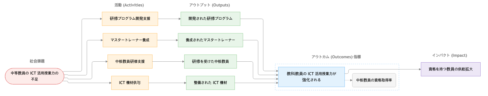
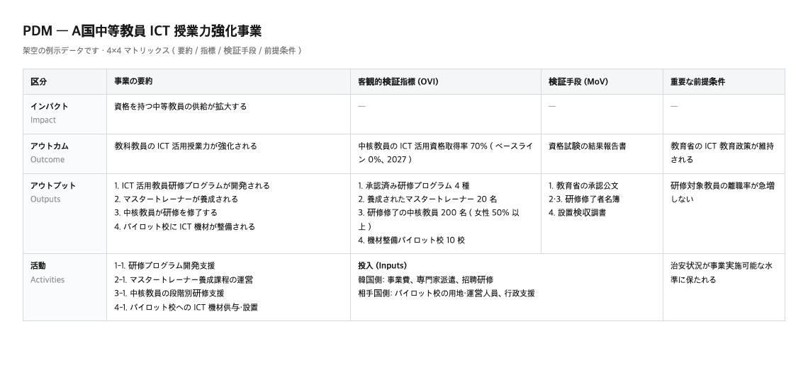

# 🌱 Theory of Change Agent

[English](README.md) · [한국어](README.ko.md) · 日本語 · [Tiếng Việt](README.vi.md)

**[インパクトスクエア（IMPACT SQUARE）](https://www.impactsquare.com)が自ら開発し、実務で使っている Theory of Change Agent は、対話を通じて社会的インパクト事業の結果連鎖（Results Chain）を構造化された文書にまとめる AI ツールです。** インパクトスタートアップ・非営利・CSR には **セオリー・オブ・チェンジ図** を、国際開発協力事業には **PDM（Project Design Matrix、成果体系表）** を出力します。

本エージェントは、解決したい社会課題、活動計画、期待する変化といった散らばった断片を一つの筋道につなぎます。質問をやり取りするうちに「何をどれだけやったか（アウトプット）」と「その結果何が変わったか（アウトカム）」が切り分けられ、**社会課題 ➔ 活動 ➔ アウトプット ➔ アウトカム ➔ インパクト** という流れが整理されます。最初から結果連鎖を設計することも、既存の事業計画の論理的な抜け漏れを点検することもできます。

こうして整理された図は、事業の論理がどれだけ堅いかを確かめる基準になり、事業計画書を練り上げるときや助成事業に応募するときの中心的な論拠になります。インパクトビジネスから非営利、開発協力事業まで幅広く使え、企画や文書化にかけていた時間を減らします。Claude などの AI 環境で動作し、会話した言語で応答します。

---

## 💡 こんなときに

* **事業アイデアをインパクトの筋道として整理するとき:** インパクトスタートアップや新規事業の散らばったアイデアを、セオリー・オブ・チェンジに沿って整理します。
* **国際開発協力事業の PDM を作成するとき:** 初期の ODA 企画を論理的に構造化します。
* **提出前にドラフトを点検するとき:** すでに書いた提案書・事業計画書・年次報告書がガイドラインに沿っているかを確認し、整えます。

---

## 🚀 用途別の成果物

プロジェクトの性格によって成果物が変わります。

| 用途 | 成果物 | 用意すると良い資料 |
| --- | --- | --- |
| **インパクトスタートアップ・新規事業** | セオリー・オブ・チェンジ図 | 事業計画書、または解決したい課題 |
| **CSR・ESG 事業** | セオリー・オブ・チェンジ図 | 事業概要書、または提案書 |
| **非営利プログラム** | セオリー・オブ・チェンジ図 | 年次報告書、またはプログラム資料 |
| **国際開発協力事業** | PDM | アイデア、提案書、既存 PDM |

> **出力ファイル構成（`out/` フォルダに保存）**
> * `toc.md`: テキスト版を含むセオリー・オブ・チェンジ図（Mermaid 非対応の環境でも確認可能）
> * `toc.html`: 同じ内容の 1 ページ文書 — ブラウザで開くと図が常に正しくレンダリングされます
> * `pdm.md`: 4×4 PDM マトリックス（国際開発協力用）
> * `details/monitoring.md`: 指標定義、計算式、ベースライン／目標、収集時期と担当をまとめた測定計画
> * `budget.md`: 活動別の費目、計算根拠、資金分担などをまとめた予算書（任意）
> * `details/toc.json`: 各成果物の元になるデータ

---

## 🖼 成果物の例

架空の例（ニカラグア中等教員 ICT 力量強化）から実際に生成した出力です。

**セオリー・オブ・チェンジ図（`toc.md` / `toc.html`）**



**PDM マトリックス（`pdm.md`）**



---

## ✨ 仕組みと主な特徴

* **論理の組み立て:** 多くの人に実際の不利益をもたらす社会課題を定義し、現象と原因を分け、原因に働きかける状態の変化をアウトカムとして整理します。活動の拡大や漠然とした便益は、アウトカムとは区別します。
* **複数プロジェクトを含む文書の処理:** 年次報告書のように複数のプロジェクトを含む文書をアップロードすると、組織全体を整理するか特定のプロジェクトに絞るかを最初に尋ねます。
* **多様なファイル入力に対応:** 対話からそのまま始められますが、PDF や韓国語 HWP ファイル（`.hwp`、`.hwpx`）もアップロードできます。HWP 抽出器は外部依存がなく、単体で動作します。

---

## ✅ 確認できる検証

組み立てた論理は検証を通ります。承認済みの企画であれば、文書を変えずにガイドラインとの相違だけを報告する「監査モード」としても使えます。

* **決定論的品質ゲート:** 純粋な Python で、インパクト指標の禁止、アウトプット数（3〜4 件）、検証手段の必須、孤立ノードの禁止など、重要な構造ルール 8 件を検査します。ベンチマークでは 18 件の違反をすべて検出しました。
* **アウトカム・指標の提案:** アウトカムが原因に働きかける変化かを確認し、IRIS+ 593 指標から近い候補を参考として提示します。
* **予算の自動検証:** 予算書の合計、比率、資金分担、一般管理費上限などをスクリプトが計算・検証します。
* **推奨ルールの提示:** SMART、CREAM、性別分解指標などを採点して示します。採用するかどうかは利用者が決めます。

---

## 🛠 はじめ方とインストール

必要なものは Claude Code、Claude デスクトップ、または claude.ai と `python3` です。

### 1. いちばん簡単な方法（AI エージェント環境）

Claude Code、Antigravity、Gemini CLI などローカルでコマンドを実行できる AI エージェントを開き、以下の段落をそのまま貼り付けてください。あとはエージェントが導入と設定を行います。

> Theory of Change Agent をインストール: `git clone --single-branch --depth 1 https://github.com/IMPACT-SQUARE/theory-of-change-agent.git ~/theory-of-change-agent` を実行し、その中の `skills/theory-of-change-agent` フォルダをあなたの環境のグローバルスキルフォルダにシンボリックリンク（またはコピー）して — Claude Code → `~/.claude/skills/`, Antigravity → `~/.gemini/config/skills/`, Gemini CLI → `~/.gemini/skills/`, ChatGPT/Codex → `~/.codex/skills/`。スキルフォルダに `SKILL.md` があることを確認してから、「Theory of Change Agent でセオリー・オブ・チェンジ図を作って」と言えば開始できること（Antigravity はセッション再起動後）、更新は `git -C ~/theory-of-change-agent pull` で行えることを教えて。

### 2. 使い方

1. チャットに「`Theory of Change Agent でセオリー・オブ・チェンジ図（または PDM）を作って`」と入力します。事業計画書や年次報告書を添付しても構いません。
2. エージェントの質問に答えながら結果連鎖を整理します。
3. 内容が固まったら「`確定`」と入力します。
4. `out/` フォルダで生成された文書を確認します。

*（※ Claude デスクトップのプラグイン追加機能や zip アップロードでのインストールにも対応しています。詳しくは `INSTALL-desktop.md` を参照してください。）*

---

## 💬 会話の例

```text
あなた:  Theory of Change Agent で企画案を作って。
Agent:    どのような事業ですか？
          ① 国際開発協力（PDM） ② インパクトスタートアップ
          ③ CSR・ESG             ④ 非営利
あなた:  ① ラオスの母子保健事業です。（スタートアップ・CSR・非営利など、希望する分野を選んでください）
Agent:    この事業が解決したい問題は何ですか。誰がどのような困難を抱えていますか？
あなた:  農村部の妊産婦が自宅で出産しています。保健施設は遠く、信頼も十分ではありません。
Agent:    問題は高い自宅分娩率で、施設へのアクセスと信頼の不足が背景にありそうです。
          アウトカムは「保健施設で出産する女性が増える」と書けます。
          「研修回数を増やす」は活動またはアウトプットです。この方向で進めますか？
          …
あなた:  確定
Agent:    ✔ 重要ルール 8 件を通過しました。
          ⚠ アウトカム 2 の「教育の拡大」は回数を表しています。行動の変化が分かる表現に直しましょう。
          結果: out/pdm.md
```

---

**🔒 データポリシー**

* `docs/` にはセオリー・オブ・チェンジの参考資料など、公開文書だけを収録しています。
* `benchmark/` の事例は架空で、実名や実際の金額は含めません。実際の事業の企画や予算原本は、このリポジトリに保存しません。

**📌 ステータス**

* バージョン 1.0 はインパクトスタートアップ、非営利、CSR・ESG、国際開発協力に対応しています。品質ゲート、予算機能、HWP 入力、プラグイン配布を含み、インパクト投資の審査機能は準備中です。

**📄 ライセンス**

* [MIT](./LICENSE) © 2026 IMPACT SQUARE.
