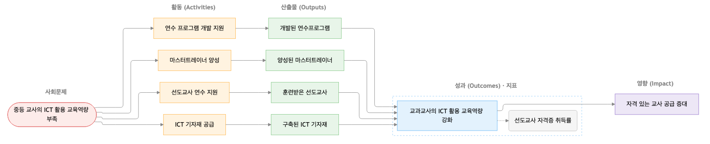
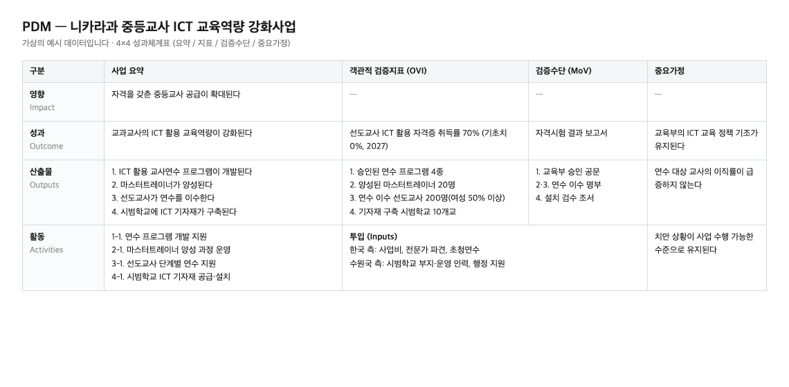

# 🌱 변화이론 에이전트 (Theory of Change Agent)

[English](README.md) · 한국어 · [日本語](README.ja.md) · [Tiếng Việt](README.vi.md)

**[임팩트스퀘어(IMPACT SQUARE)](https://www.impactsquare.com)가 직접 개발해 실무에 사용하는 변화이론 에이전트는, 대화를 통해 사회적 임팩트 프로젝트의 결과사슬(Results Chain)을 구조화된 문서로 만들어 주는 AI 도구입니다.** 임팩트 스타트업·비영리·CSR에는 **변화이론(Theory of Change) 도식**으로, 국제개발협력 사업에는 **PDM(Project Design Matrix, 성과체계표)** 으로 출력합니다.

에이전트는 해결하려는 사회 문제, 활동 계획, 기대하는 변화처럼 흩어져 있는 조각들을 하나의 논리로 꿰어냅니다. 질문을 주고받다 보면 "무엇을 얼마나 했는가(산출물)"와 "그래서 무엇이 달라졌는가(성과)"가 구분되고, **사회문제 ➔ 활동 ➔ 산출물 ➔ 성과 ➔ 영향**으로 이어지는 흐름이 정리됩니다. 처음부터 결과사슬을 설계할 수도, 기존 프로젝트 계획의 논리적 허점을 점검할 수도 있습니다.

이렇게 정리된 도식은 사업의 논리가 탄탄한지 점검하는 기준이 되고, 사업계획서를 다듬거나 지원사업에 신청할 때 핵심 논거가 됩니다. 임팩트 비즈니스부터 비영리, 개발협력 사업까지 두루 쓰이며, 기획과 문서화에 들이던 시간을 줄여 줍니다. Claude 같은 AI 환경에서 작동하고, 대화한 언어로 답합니다.

---

## 💡 이럴 때 추천합니다

* **사업 아이디어를 임팩트 논리로 정리할 때:** 임팩트 스타트업이나 신규 사업의 흩어진 아이디어를 변화이론에 맞춰 정리합니다.
* **국제개발협력 사업의 PDM을 작성할 때:** 초기 ODA 기획을 논리적으로 구조화합니다.
* **제출 전 초안을 점검할 때:** 이미 쓴 제안서·사업계획서·연차보고서가 가이드라인에 맞는지 점검하고 다듬습니다.

---

## 🚀 용도별 맞춤 결과물

프로젝트 성격에 따라 결과물이 달라집니다.

| 할 일 | 결과물 | 준비하면 좋은 자료 |
| --- | --- | --- |
| **임팩트 스타트업·신규사업** | 변화이론 도식 | 사업계획서 또는 해결하려는 문제 |
| **CSR·ESG 사업** | 변화이론 도식 | 사업 개요서 또는 제안서 |
| **비영리 프로그램** | 변화이론 도식 | 연차보고서 또는 프로그램 자료 |
| **국제개발협력 사업** | PDM | 아이디어, 제안서, 기존 PDM |

> **출력 파일 구성 (`out/` 폴더 내 저장)**
> * `toc.md`: 텍스트 흐름을 포함한 변화이론 도식 (Mermaid 미지원 환경에서도 확인 가능)
> * `toc.html`: 같은 내용을 담은 문서형 한 페이지 — 브라우저로 열면 도식이 항상 올바르게 렌더됩니다
> * `pdm.md`: 4×4 PDM 매트릭스 (국제개발협력용)
> * `details/monitoring.md`: 지표 정의, 산식, 기초치/목표치, 수집 시기 및 담당을 담은 측정 계획
> * `budget.md`: 활동별 세목, 산출근거, 재원 분담 등을 담은 예산서 (선택 사항)
> * `details/toc.json`: 각 결과물을 생성하는 원본 데이터

---

## 🖼 결과물 예시

가상의 예시(니카라과 중등교사 ICT 역량 강화)로 실제 생성한 결과물입니다.

**변화이론 도식 (`toc.md` / `toc.html`)**



**PDM 매트릭스 (`pdm.md`)**



---

## ✨ 작동 방식 및 주요 특징

* **논리적 도출:** 다수에게 실제 피해를 주는 사회문제를 정의하고, 현상과 원인을 구분해 원인을 줄이는 상태 변화를 성과로 정리합니다. 활동의 확대나 단순 기대효과는 성과와 구분합니다.
* **여러 프로젝트가 담긴 문서 처리:** 연차보고서처럼 여러 프로젝트가 담긴 문서를 업로드하면, 조직 전체의 구조를 볼지 특정 프로젝트 하나를 다룰지 먼저 물어봅니다.
* **다양한 파일 입력 지원:** 대화로 바로 시작할 수도 있지만, PDF나 한글 파일(`.hwp`, `.hwpx`)을 올릴 수도 있습니다. 한글 파일 추출기는 외부 라이브러리 없이 독립적으로 동작합니다.

---

## ✅ 확인 가능한 검증

완성된 논리는 검증 과정을 거칩니다. 이미 승인된 기획안이라면 문서를 바꾸지 않고 가이드라인 위반 여부만 알려주는 '감사 모드'로도 활용할 수 있습니다.

* **결정적 품질 게이트:** 순수 Python으로 영향 지표 금지, 산출물 개수(3~4개), 검증수단 필수, 고아 노드 금지 등 핵심 구조 규칙 8개를 검사합니다. 벤치마크 테스트에서 18개 위반을 모두 찾아냈습니다.
* **성과 및 지표 제안:** 성과가 원인을 다루는 변화인지 검토하며, IRIS+ 593개 지표 중 가장 가까운 항목을 참고용으로 제안합니다.
* **예산 자동 검증:** 예산서의 합계, 비율, 재원 분담, 일반관리비 상한 등을 스크립트가 직접 계산하고 검증합니다.
* **권장 규칙 제공:** SMART, CREAM, 성별 분리 지표 등을 점수화하여 알려주며, 적용 여부는 사용자가 직접 결정합니다.

---

## 🛠 빠른 시작 및 설치

준비물은 Claude Code, Claude 데스크톱 또는 claude.ai 환경과 `python3`입니다.

### 1. 가장 쉬운 방법 (AI 에이전트 환경)

Claude Code, Antigravity, Gemini CLI 등 로컬 명령이 가능한 AI 에이전트를 열고 아래 문단을 그대로 붙여넣으세요. 나머지는 에이전트가 알아서 설치하고 설정합니다.

> 변화이론 에이전트 설치: `git clone --single-branch --depth 1 https://github.com/IMPACT-SQUARE/theory-of-change-agent.git ~/theory-of-change-agent` 를 실행한 뒤, 그 안의 `skills/theory-of-change-agent` 폴더를 네 환경의 전역 스킬 폴더에 심링크(또는 복사)해줘 — Claude Code → `~/.claude/skills/`, Antigravity → `~/.gemini/config/skills/`, Gemini CLI → `~/.gemini/skills/`, ChatGPT/Codex → `~/.codex/skills/`. 스킬 폴더 안에 `SKILL.md`가 있는지 확인하고, "변화이론 에이전트로 변화이론 도식 만들어줘"라고 하면 시작할 수 있다는 것(Antigravity는 세션 재시작 후)과, 업데이트는 `git -C ~/theory-of-change-agent pull` 로 하면 된다는 것을 알려줘.

### 2. 사용 방법

1. 채팅창에 "`변화이론 에이전트로 변화이론 도식(또는 PDM) 만들어줘`"라고 입력합니다. 사업계획서나 연차보고서를 함께 첨부해도 됩니다.
2. 에이전트의 질문에 답하며 결과사슬을 정리합니다.
3. 도출된 결과가 맞으면 "`확정`"이라고 입력합니다.
4. `out/` 폴더에서 생성된 문서를 확인합니다.

*(※ Claude 데스크톱의 플러그인 추가 기능이나 zip 파일 업로드를 통한 설치도 지원합니다. 자세한 내용은 `INSTALL-desktop.md`를 참고하세요.)*

---

## 💬 대화 예시

```text
나:      변화이론 에이전트로 기획안 만들어줘.
에이전트: 어떤 사업인가요?
         ① 국제개발협력(PDM)  ② 임팩트 스타트업
         ③ CSR·ESG            ④ 비영리
나:      ① 라오스 모자보건 사업이야. (※스타트업, CSR, 비영리 등 원하는 분야를 선택하세요)
에이전트: 이 사업이 해결하려는 문제는 무엇인가요? 누가 어떤 어려움을 겪고 있나요?
나:      농촌 산모들이 집에서 분만해. 보건소가 멀고 믿지 못하기도 해.
에이전트: 핵심 문제는 높은 가정분만율이고, 원인은 시설 접근성과 신뢰 부족으로 보입니다.
         그러면 성과는 "시설분만을 선택하는 산모가 늘어난다"처럼 써 볼 수 있습니다.
         "교육 횟수를 늘린다"는 활동 또는 산출물에 가깝습니다. 이 방향이 맞을까요?
         …
나:      확정
에이전트: ✔ 핵심 규칙 8개를 통과했습니다.
         ⚠ 성과 2의 "교육 확대"는 횟수를 말합니다. 행동 변화를 나타내도록 수정해 보세요.
         최종 결과: out/pdm.md
```

---

**🔒 데이터 정책**

* `docs/` 폴더에는 변화이론 참고자료 등 공개 문서만 있습니다.
* `benchmark/`의 사례는 가상 데이터이며, 실제 이름과 금액은 포함하지 않습니다. 실제 사업의 기획안과 예산 원본은 이 저장소에 저장하지 않습니다.

**📌 프로젝트 상태**

* 버전 1.0은 임팩트 스타트업, 비영리, CSR·ESG, 국제개발협력을 지원합니다. 품질 게이트, 예산 기능, HWP 입력, 플러그인 배포를 포함하며 임팩트 투자 심사 기능은 준비 중입니다.

**📄 라이선스**

* [MIT](./LICENSE) © 2026 IMPACT SQUARE.
