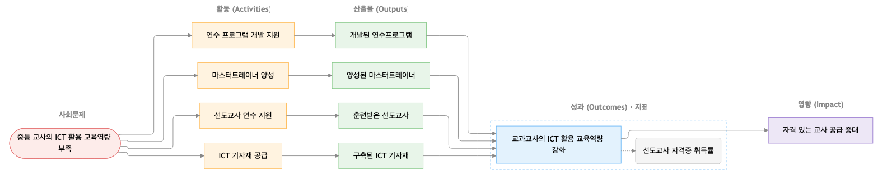
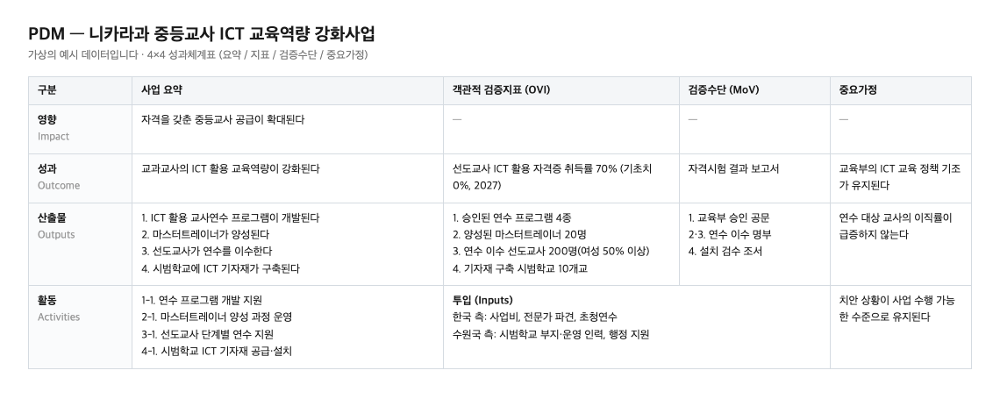

# 🌱 Theory of Change Agent

English · [한국어](README.ko.md) · [日本語](README.ja.md) · [Tiếng Việt](README.vi.md)

**[IMPACT SQUARE](https://www.impactsquare.com) built the Theory of Change Agent and uses it in its own practice — an AI tool that turns a conversation into a structured results chain for your social-impact project.** It renders a **Theory of Change diagram** for impact startups, nonprofits, and CSR, or a **PDM (Project Design Matrix)** for international-development projects.

The agent connects the scattered pieces — the social problem you want to solve, your planned activities, the change you're aiming for — into a single logic. As you answer its questions, "what you did and how much (outputs)" and "what actually changed (outcomes)" come apart, and a chain takes shape: **social problem ➔ activities ➔ outputs ➔ outcomes ➔ impact**. You can design a results chain from scratch, or check an existing project plan for gaps in its logic.

The finished diagram becomes a yardstick for how well your logic holds together, and a core argument when you refine a business plan or apply for funding. It is used across impact business, nonprofits, and development cooperation, and cuts down the time you used to spend on planning and documentation. It runs inside AI assistants such as Claude and replies in the language you use.

---

## 💡 When to use it

* **Turning a business idea into impact logic:** organize the scattered ideas of an impact startup or new venture along Theory-of-Change lines.
* **Writing a PDM for an international-development project:** give structure to an early-stage ODA design.
* **Checking a draft before you submit:** see whether an existing proposal, business plan, or annual report holds up against the guideline, and refine it.

---

## 🚀 Output by use case

The output depends on the nature of your project.

| Your situation | Output | Good starting material |
| --- | --- | --- |
| **Impact startup / new venture** | Theory of Change diagram | A business plan or the problem you're solving |
| **CSR / ESG project** | Theory of Change diagram | A program brief or proposal |
| **Nonprofit program** | Theory of Change diagram | An annual report or program material |
| **International-development project** | PDM | An idea, proposal, or existing PDM |

> **Output files (saved under `out/`)**
> * `toc.md`: Theory of Change diagram, with a text version for viewers that don't support Mermaid
> * `toc.html`: the same content as a designed single-page document — open it in a browser for a pinned, always-correct diagram render
> * `pdm.md`: 4×4 PDM matrix (international development)
> * `details/monitoring.md`: per-indicator measurement plan — definition, formula, baseline/target, timing, and collector
> * `budget.md`: budget with per-activity line items, calculation basis, and funder split (optional)
> * `details/toc.json`: the source data behind every view above

---

## 🖼 Output examples

Real output, generated from a fictional example (secondary-teacher ICT capacity project in Nicaragua).

**Theory of Change diagram (`toc.md` / `toc.html`)**



**PDM matrix (`pdm.md`)**



---

## ✨ How it works

* **Rigorous logic:** it defines a social problem that is structural, affects many people, and causes real harm; separates symptoms from causes; and frames outcomes as changes that address those causes. Scaling up activities or vague benefits are kept distinct from outcomes.
* **Handles multi-project documents:** upload something like an annual report and it first asks whether to map the whole organization or focus on a single project.
* **Flexible input:** start from a conversation, or upload a PDF or Korean HWP file (`.hwp`, `.hwpx`). The HWP extractor has no external dependencies, so it runs in app sandboxes.

---

## ✅ Verification you can check

The finished logic goes through a verification pass. For an already-approved plan, an audit mode reports only where it diverges from the guideline, without changing the document.

* **Deterministic quality gate:** pure Python checks eight critical structural rules — no impact indicators, three to four outputs, required means of verification, no orphan nodes, and more. It caught all 18 violations on the seeded benchmark.
* **Outcome & indicator suggestions:** it checks whether an outcome addresses its underlying cause, and matches indicators to the closest of the 593 IRIS+ metrics for reference.
* **Automatic budget checks:** a script computes and validates every total, ratio, funder split, and general-management cap.
* **Advisory rules:** SMART, CREAM, and gender-disaggregated indicators are scored; you decide whether to act on them.

---

## 🛠 Quick start & install

You need Claude Code, Claude desktop, or claude.ai, plus `python3`.

### 1. Easiest: paste into your AI agent

Open an AI agent that can run local commands (Claude Code, Antigravity, Gemini CLI, …) and paste the paragraph below. The agent installs and configures the rest.

> Install the Theory of Change Agent: run `git clone --single-branch --depth 1 https://github.com/IMPACT-SQUARE/theory-of-change-agent.git ~/theory-of-change-agent`, then symlink (or copy) the `skills/theory-of-change-agent` folder inside it into your environment's global skills folder — Claude Code → `~/.claude/skills/`, Antigravity → `~/.gemini/config/skills/`, Gemini CLI → `~/.gemini/skills/`, ChatGPT/Codex → `~/.codex/skills/`. Confirm that `SKILL.md` exists in the skills folder, then tell me I can start by saying "Make a theory of change with the Theory of Change Agent" (restart the session first in Antigravity), and that I can update later with `git -C ~/theory-of-change-agent pull`.

### 2. How to use

1. Type "`Make a theory of change (or PDM) with the Theory of Change Agent`" in the chat. You can attach a business plan or annual report.
2. Answer the agent's questions to build the results chain.
3. When the result is right, type "`finalize`".
4. Find the generated documents in the `out/` folder.

*(You can also install via the Claude desktop plugin feature or by uploading a zip. See `INSTALL-desktop.md` for details.)*

---

## 💬 Example conversation

```text
You:    Make a plan with the Theory of Change Agent.
Agent:  What kind of project is it?
        ① International development (PDM)  ② Impact startup
        ③ CSR / ESG                       ④ Nonprofit
You:    ①. A maternal-health project in Laos. (choose the field you want — startup, CSR, nonprofit, etc.)
Agent:  What problem does this project tackle? Who is struggling, and why?
You:    Mothers in rural areas deliver at home. Clinics are far, and people don't trust them.
Agent:  The core problem is a high rate of home deliveries, and the causes look like limited access
        to facilities and low trust in them. An outcome could read "more women give birth in health
        facilities." "Increase the number of training sessions" is closer to an activity or output.
        Does that reflect what you want?
        …
You:    finalize
Agent:  ✔ Passed all 8 critical rules.
        ⚠ Outcome 2, "expanded education," counts sessions. Reword it to show a change in behavior.
        Result: out/pdm.md
```

---

**🔒 Data policy**

* `docs/` contains public reference documents only, such as Theory of Change references.
* The cases in `benchmark/` are fictional and contain no real names or amounts. Real project plans and budgets are never stored in this repository.

**📌 Status**

* Version 1.0 supports impact startups, nonprofits, CSR/ESG, and international development. It includes the quality gate, budget support, HWP input, and plugin distribution; impact-investor screening is planned.

**📄 License**

* [MIT](./LICENSE) © 2026 IMPACT SQUARE.
