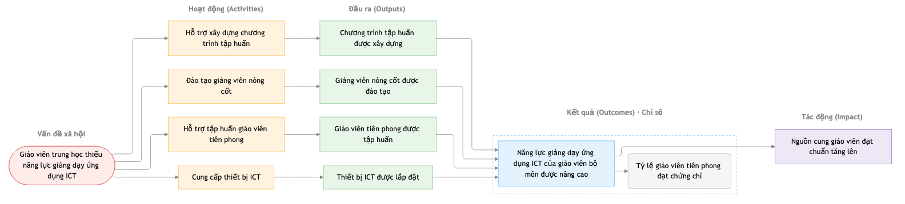
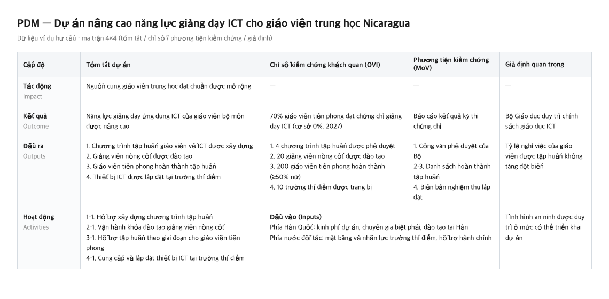

# 🌱 Theory of Change Agent

[English](README.md) · [한국어](README.ko.md) · [日本語](README.ja.md) · Tiếng Việt

**[IMPACT SQUARE](https://www.impactsquare.com) tự phát triển và sử dụng trong công việc thực tế — Theory of Change Agent là công cụ AI biến một cuộc trao đổi thành chuỗi kết quả (Results Chain) có cấu trúc cho dự án tạo tác động xã hội của bạn.** Công cụ xuất ra **sơ đồ Theory of Change** cho startup tạo tác động, tổ chức phi lợi nhuận và CSR, hoặc **PDM (Project Design Matrix)** cho dự án hợp tác phát triển quốc tế.

Công cụ kết nối những mảnh rời rạc — vấn đề xã hội bạn muốn giải quyết, kế hoạch hoạt động, thay đổi bạn kỳ vọng — thành một mạch logic duy nhất. Qua quá trình hỏi đáp, "đã làm gì và làm bao nhiêu (đầu ra)" và "nhờ đó điều gì đã thay đổi (kết quả)" được tách bạch, và dòng chảy **vấn đề xã hội ➔ hoạt động ➔ đầu ra ➔ kết quả ➔ tác động** dần hình thành. Bạn có thể thiết kế chuỗi kết quả từ đầu, hoặc rà soát những lỗ hổng logic trong kế hoạch dự án hiện có.

Sơ đồ hoàn chỉnh trở thành thước đo mức độ chặt chẽ trong logic của dự án, và là luận cứ cốt lõi khi bạn hoàn thiện kế hoạch kinh doanh hoặc nộp hồ sơ xin tài trợ. Công cụ được dùng rộng rãi từ kinh doanh tạo tác động đến phi lợi nhuận và hợp tác phát triển, giúp giảm thời gian vốn phải bỏ ra cho việc lập kế hoạch và soạn tài liệu. Nó hoạt động trên các môi trường AI như Claude và trả lời bằng ngôn ngữ bạn đang dùng.

---

## 💡 Phù hợp khi nào

* **Sắp xếp ý tưởng kinh doanh thành logic tác động:** hệ thống hóa những ý tưởng rời rạc của startup tạo tác động hoặc dự án mới theo Theory of Change.
* **Lập PDM cho dự án hợp tác phát triển quốc tế:** cấu trúc hóa một thiết kế ODA giai đoạn đầu.
* **Kiểm tra bản nháp trước khi gửi:** xem đề xuất, kế hoạch kinh doanh hay báo cáo thường niên đã viết có đúng hướng dẫn không, rồi tinh chỉnh.

---

## 🚀 Kết quả theo mục đích

Kết quả thay đổi theo tính chất của dự án.

| Tình huống | Kết quả | Tài liệu nên chuẩn bị |
| --- | --- | --- |
| **Startup tạo tác động / dự án mới** | Sơ đồ Theory of Change | Kế hoạch kinh doanh hoặc vấn đề cần giải quyết |
| **Dự án CSR / ESG** | Sơ đồ Theory of Change | Mô tả chương trình hoặc đề xuất |
| **Chương trình phi lợi nhuận** | Sơ đồ Theory of Change | Báo cáo thường niên hoặc tài liệu chương trình |
| **Dự án hợp tác phát triển quốc tế** | PDM | Ý tưởng, đề xuất hoặc PDM hiện có |

> **Các tệp đầu ra (lưu trong thư mục `out/`)**
> * `toc.md`: sơ đồ Theory of Change kèm phiên bản văn bản cho nơi không hỗ trợ Mermaid
> * `toc.html`: cùng nội dung dưới dạng tài liệu một trang — mở bằng trình duyệt để sơ đồ luôn hiển thị đúng
> * `pdm.md`: ma trận PDM 4×4 (hợp tác phát triển quốc tế)
> * `details/monitoring.md`: kế hoạch đo lường theo từng chỉ số — định nghĩa, công thức, cơ sở/mục tiêu, thời điểm và người thu thập
> * `budget.md`: ngân sách với hạng mục theo hoạt động, căn cứ tính và phân bổ vốn (tùy chọn)
> * `details/toc.json`: dữ liệu gốc dùng để tạo mọi tệp trên

---

## 🖼 Ví dụ kết quả

Kết quả thực tế, tạo từ một ví dụ hư cấu (dự án nâng cao năng lực ICT cho giáo viên trung học ở Nicaragua).

**Sơ đồ Theory of Change (`toc.md` / `toc.html`)**



**Ma trận PDM (`pdm.md`)**



---

## ✨ Cách hoạt động và đặc điểm chính

* **Xây dựng logic:** công cụ xác định vấn đề xã hội có tính cấu trúc, ảnh hưởng đến nhiều người và gây tổn hại thực; phân biệt hiện tượng với nguyên nhân; và xác định kết quả là thay đổi tác động vào nguyên nhân. Việc mở rộng hoạt động hay lợi ích chung chung được tách khỏi kết quả.
* **Xử lý tài liệu chứa nhiều dự án:** khi bạn tải lên tài liệu như báo cáo thường niên, công cụ hỏi trước là nên lập sơ đồ cho toàn tổ chức hay tập trung vào một dự án.
* **Hỗ trợ nhiều loại đầu vào:** bạn có thể bắt đầu bằng hội thoại, hoặc tải lên PDF và tệp HWP tiếng Hàn (`.hwp`, `.hwpx`). Bộ trích xuất HWP không cần thư viện ngoài nên chạy độc lập.

---

## ✅ Các kiểm tra có thể xác nhận

Logic hoàn chỉnh sẽ qua một bước kiểm tra. Với kế hoạch đã được phê duyệt, chế độ kiểm toán chỉ báo những điểm khác hướng dẫn mà không thay đổi tài liệu.

* **Cổng chất lượng xác định:** Python thuần kiểm tra 8 quy tắc cấu trúc quan trọng — cấm chỉ số tác động, số đầu ra (3–4), bắt buộc phương tiện kiểm chứng, cấm nút mồ côi, v.v. Nó phát hiện đủ 18 vi phạm trên benchmark.
* **Gợi ý kết quả và chỉ số:** kiểm tra xem kết quả có xử lý nguyên nhân hay không, và đối chiếu chỉ số với chỉ số gần nhất trong 593 chỉ số IRIS+ để tham khảo.
* **Tự động kiểm tra ngân sách:** một script tính và kiểm tra mọi tổng, tỷ lệ, phân bổ vốn và trần chi phí quản lý.
* **Quy tắc khuyến nghị:** SMART, CREAM và chỉ số phân tách giới tính được chấm điểm; bạn tự quyết định có áp dụng hay không.

---

## 🛠 Bắt đầu nhanh & cài đặt

Cần có Claude Code, Claude desktop hoặc claude.ai cùng `python3`.

### 1. Cách dễ nhất (môi trường AI agent)

Mở một AI agent có thể chạy lệnh cục bộ (Claude Code, Antigravity, Gemini CLI, …) và dán nguyên đoạn dưới đây. Agent sẽ tự cài đặt và cấu hình phần còn lại.

> Cài Theory of Change Agent: chạy `git clone --single-branch --depth 1 https://github.com/IMPACT-SQUARE/theory-of-change-agent.git ~/theory-of-change-agent`, sau đó symlink (hoặc sao chép) thư mục `skills/theory-of-change-agent` bên trong vào thư mục skills toàn cục của môi trường bạn — Claude Code → `~/.claude/skills/`, Antigravity → `~/.gemini/config/skills/`, Gemini CLI → `~/.gemini/skills/`, ChatGPT/Codex → `~/.codex/skills/`. Xác nhận tệp `SKILL.md` tồn tại trong thư mục skill, rồi cho tôi biết tôi có thể bắt đầu bằng câu "Tạo sơ đồ Theory of Change bằng Theory of Change Agent" (với Antigravity cần khởi động lại phiên) và cập nhật sau này bằng `git -C ~/theory-of-change-agent pull`.

### 2. Cách dùng

1. Nhập "`Tạo sơ đồ Theory of Change (hoặc PDM) bằng Theory of Change Agent`" vào chat. Bạn có thể đính kèm kế hoạch kinh doanh hoặc báo cáo thường niên.
2. Trả lời câu hỏi của agent để sắp xếp chuỗi kết quả.
3. Khi kết quả đã đúng, nhập "`chốt`".
4. Xem các tài liệu được tạo trong thư mục `out/`.

*(※ Cũng hỗ trợ cài qua tính năng plugin của Claude desktop hoặc tải lên zip. Xem `INSTALL-desktop.md` để biết chi tiết.)*

---

## 💬 Ví dụ hội thoại

```text
Bạn:    Tạo một bản kế hoạch bằng Theory of Change Agent.
Agent:  Dự án của bạn thuộc loại nào?
        ① Hợp tác phát triển quốc tế  ② Startup tạo tác động
        ③ CSR / ESG                  ④ Phi lợi nhuận
Bạn:    ① Dự án sức khỏe bà mẹ ở Lào. (hãy chọn lĩnh vực bạn muốn — startup, CSR, phi lợi nhuận, v.v.)
Agent:  Dự án muốn giải quyết vấn đề gì? Ai đang gặp khó khăn và vì sao?
Bạn:    Phụ nữ nông thôn sinh con tại nhà. Trạm y tế xa và người dân không tin tưởng.
Agent:  Vấn đề cốt lõi là tỷ lệ sinh tại nhà cao, nguyên nhân có thể là khả năng tiếp cận
        và niềm tin vào cơ sở y tế còn thấp. Kết quả có thể viết là "nhiều phụ nữ sinh tại cơ sở y tế hơn".
        "Tăng số buổi đào tạo" gần với hoạt động hoặc đầu ra hơn. Có đúng hướng không?
        …
Bạn:    chốt
Agent:  ✔ Đã qua 8 quy tắc bắt buộc.
        ⚠ "Mở rộng đào tạo" ở kết quả 2 đang mô tả số lượng. Hãy nêu thay đổi hành vi.
        Kết quả: out/pdm.md
```

---

**🔒 Chính sách dữ liệu**

* `docs/` chỉ chứa tài liệu công khai, gồm tài liệu tham khảo Theory of Change.
* Các tình huống trong `benchmark/` là hư cấu, không có tên hoặc số tiền thật. PDM và ngân sách của dự án thực không được lưu trong kho này.

**📌 Trạng thái**

* Phiên bản 1.0 hỗ trợ startup tạo tác động, phi lợi nhuận, CSR/ESG và hợp tác phát triển quốc tế. Bao gồm cổng chất lượng, mô-đun ngân sách, đầu vào HWP và phân phối dạng plugin; chức năng thẩm định đầu tư tác động đang được chuẩn bị.

**📄 Giấy phép**

* [MIT](./LICENSE) © 2026 IMPACT SQUARE.
