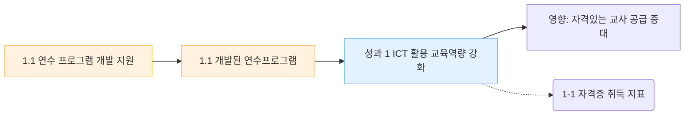

# 변화이론 — 니카라과 ICT 사업 (초안)

## 1. 변화이론 도식

```mermaid
flowchart LR
  classDef act fill:#fff3e0,stroke:#ffb74d;
  classDef outcome fill:#e3f2fd,stroke:#64b5f6;
  act_1["1.1 연수 프로그램 개발 지원"] --> op_1["1.1 개발된 연수프로그램"]
  op_1 --> oc_1["성과 1 ICT 활용 교육역량 강화"]
  oc_1 --> imp_1["영향: 자격있는 교사 공급 증대"]
  oc_1 -.-> ind_oc_1_1("1-1 자격증 취득 지표")
  class act_1,op_1 act
  class oc_1 outcome
```

> 참고: KOICA 가이드라인상 PDM 매트릭스에는 기초치를 담지 않습니다.
