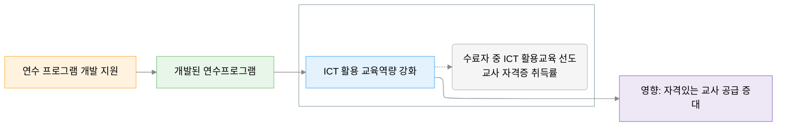

# 변화이론 (Theory of Change) — 니카라과 ICT 활용 교육역량 강화사업

## 1. 변화이론 도식

**사회문제 → 활동 (Activities) → 산출물 (Outputs) → 성과 (Outcomes) · 지표 → 영향 (Impact)**



```
사회문제 → [활동 1.1 연수 프로그램 개발] → [산출물 1.1 개발된 연수프로그램] → (성과 1 ICT 활용 교육역량 강화 ↑) → 영향: 자격있는 교사 공급 증대
                                                                              └ 지표: [1-1 수료자 중 ICT 활용교육 선도교사 자격증 취득률]
```
